# 🌦️ RevGlacierSMA-Mobile - Application de Supervision et débogage d’une Station Météo Autonome

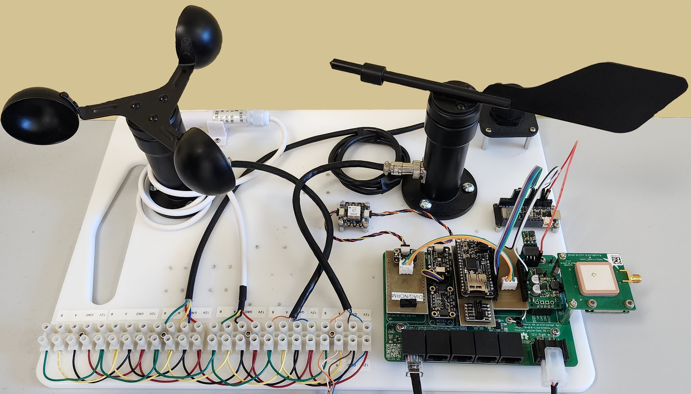

Cette application mobile Flutter permet de superviser en temps réel une station météo connectée (via
câble USB ou Bluetooth). Elle a été développée dans un environnement industriel réel dans le cadre
d’un stage de fin d’études. Le projet inclut la lecture de capteurs internes et externes,
l’affichage dynamique des données, des outils de configuration, de test et de diagnostic, ainsi
qu’une interface moderne et réactive.

> ⚠️ **Important** : Cette application a été développée pour une station météo spécifique basée sur
> un microcontrôleur Arduino, avec un jeu de capteurs prédéfini, un protocole série personnalisé, et
> une configuration matérielle bien précise. Elle **ne peut pas être utilisée telle quelle** avec un
> autre matériel sans modifications majeures. Ce projet est donc destiné principalement à un usage
> interne ou personnel.

## 📸 Aperçu visuel

| **Écran de Connexion**                                      | **Écran d'Accueil**                                                                 |
|-------------------------------------------------------------|-------------------------------------------------------------------------------------|
| 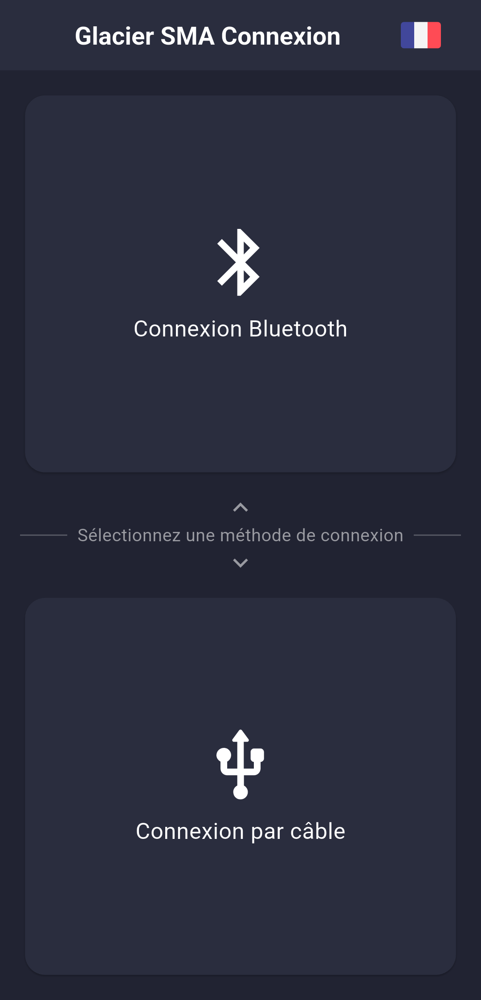                         | 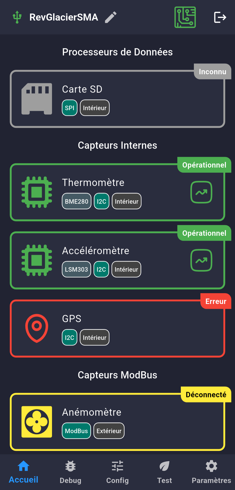                                                   |
| Permet de se connecter à Arduino via un Câble ou Bluetooth. | Affiche tous les capteurs actifs, leur statut, emplacement et le type de connexion. |

| **Le Popup des capteurs**                                                            | **Le Graphique des capteurs**                                                            |
|--------------------------------------------------------------------------------------|------------------------------------------------------------------------------------------|
| 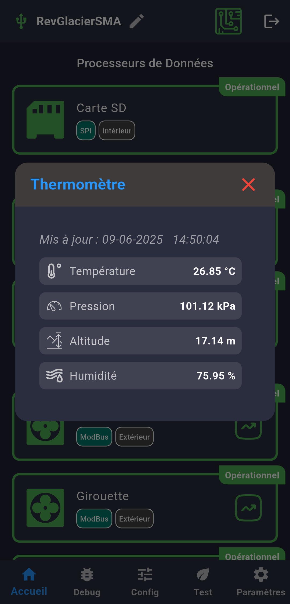                                                    | 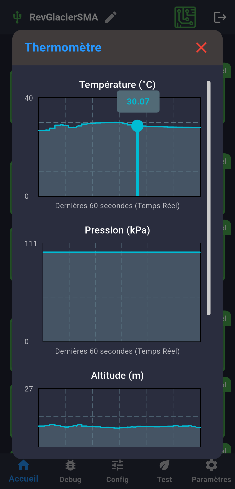                                                        |
| Affiche l'information des capteurs en forme du texte. Se rafraîchit automatiquement. | Affiche l'information des capteurs en forme du Graphique. Se rafraîchit automatiquement. |

| **Écran de Débogage**                                                                                                                    | **Écran de Configuration**                   |
|------------------------------------------------------------------------------------------------------------------------------------------|----------------------------------------------|
| 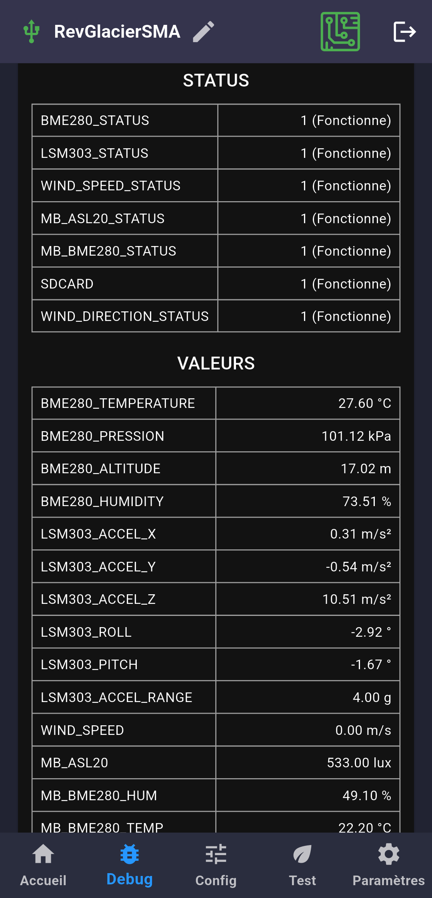                                                                                                          | 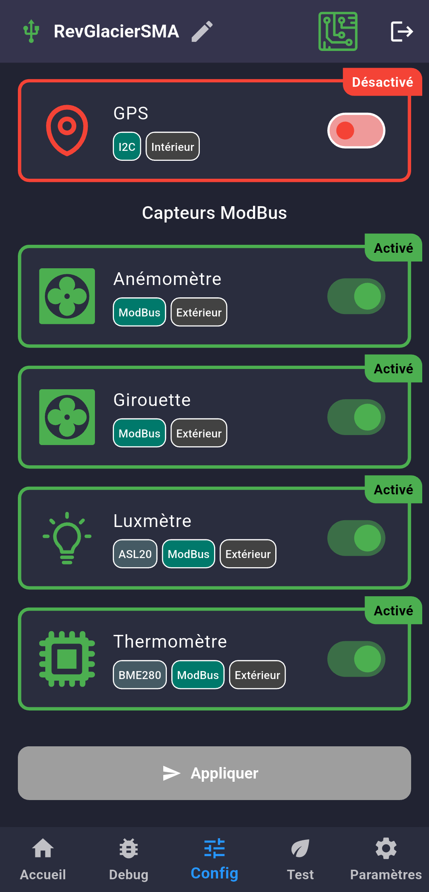             |
| Écran plus technique qui montre les données des sensors en Brut et avec minimes modifications visuels ainsi que les capteurs désactivés. | Permet d'activer te désactiver les capteurs. |

| **Écran de Configuration**                   | **Écran de l'Environnement contrôlé**                                                |
|----------------------------------------------|--------------------------------------------------------------------------------------|
| 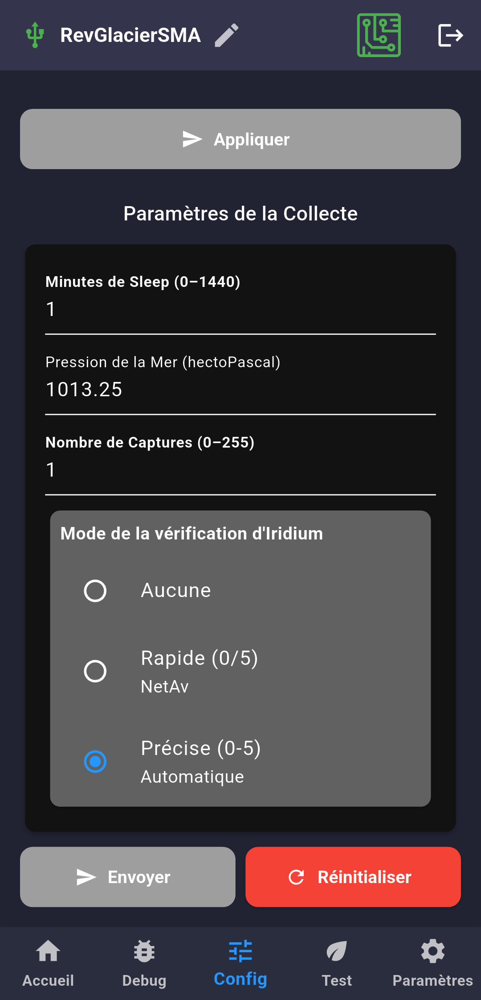             | 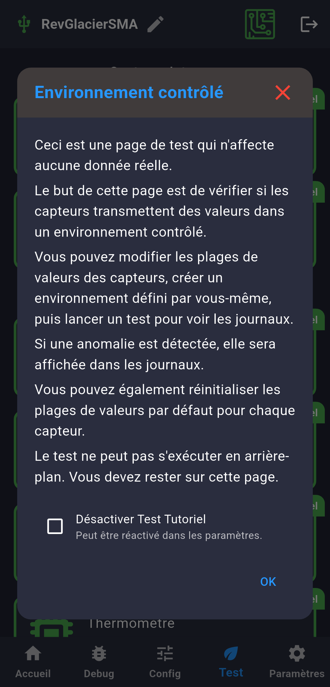                                                       |
| Permet également de paramétrer les capteurs. | Permet de tester la validité de données des capteurs dans un environnement contrôlé. |

| **Écran de l'Environnement contrôlé**               | **Écran de l'Environnement contrôlé**      |
|-----------------------------------------------------|--------------------------------------------|
| 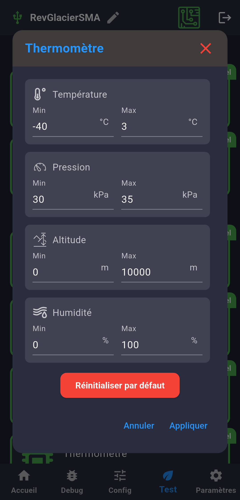                      | 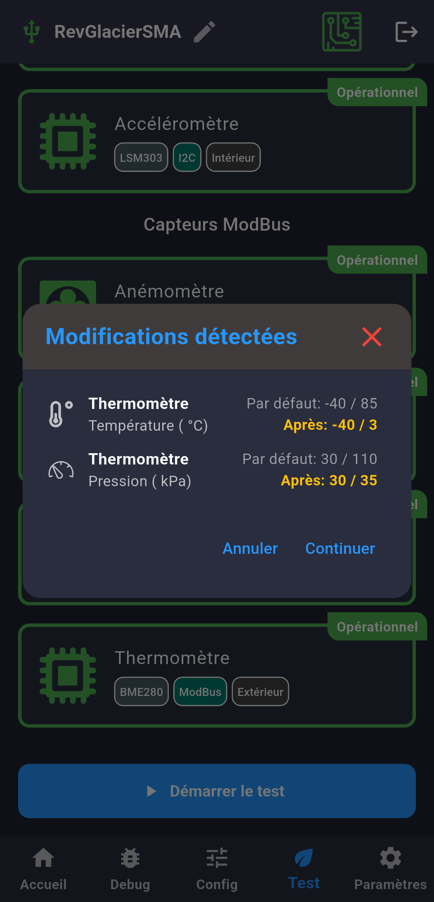            |
| Configuration de l'Environnement contrôlé souhaité. | Affiche également la configuration défini. |

| **Écran de l'Environnement contrôlé**                                                                                   | **Écran de l'Environnement contrôlé**                                                     |
|-------------------------------------------------------------------------------------------------------------------------|-------------------------------------------------------------------------------------------|
| 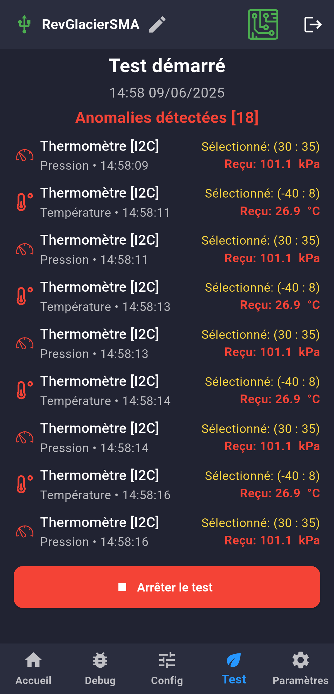                                                                                         | 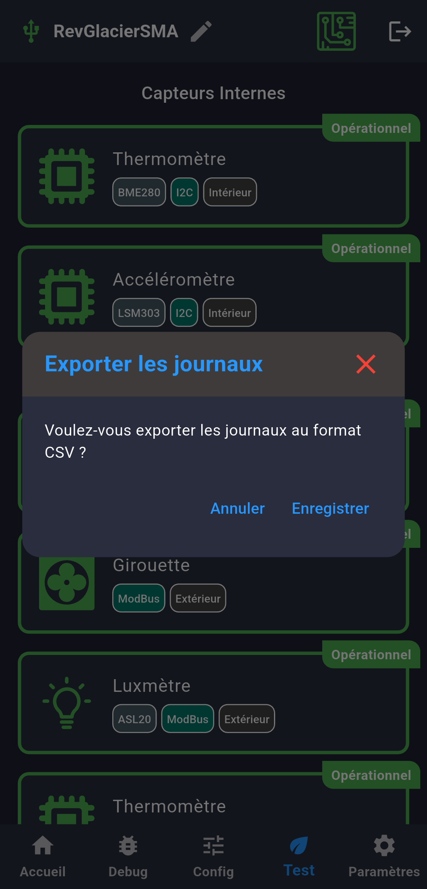                                                           |
| Comparaison automatique des valeurs réelles vs attendues permet de voir si le capteurs transmet les données incorrects. | À la fin d'un Test, utilisateur peut sauvegarder le fichier CSV pour le traitement futur. |

| **Écran de Paramètres**               | **Écran de Paramètres**               |
|---------------------------------------|---------------------------------------|
| 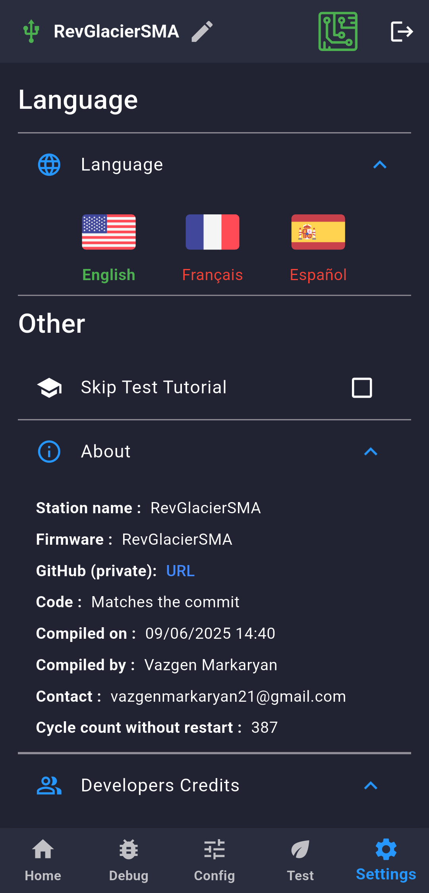 | 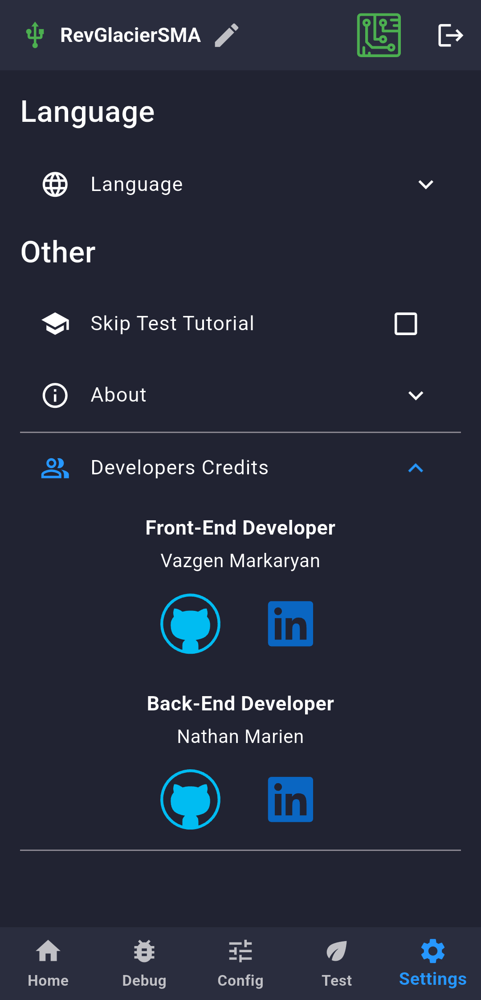 |

## 🚀 Fonctionnalités principales

### 🔌 Connexion multiplateforme

- Détection automatique des Appareils série via câble USB
- Connexion Bluetooth avec sélection d'appareil
- Gestion des déconnexions et reconnexions

### 📊 Visualisation des capteurs

- Affichage des capteurs regroupés par type (Internes, ModBus)
- Cartes capteurs avec valeurs, unité, et statut en direct
- Popup animé affichant les détails : valeurs RAM, tension batterie

### 🔍 Debug & Logs

- Écran `DebugLog` avec deux sections :
    - **Status** : liste de tous les capteurs et leur état (codes et texte)
    - **Valeurs** : affichage brut des dernières données reçues

### 🧪 Mode test & simulation

- Test de capteurs fictifs (anomalies, plages dynamiques)
- Sauvegarde en CSV dans le répertoire `Download` du téléphone
- Affichage différentiel des mesures pour débogage fin

### ⚙️ Paramétrage complet

- Écran des paramètres avec sections configurables
- Affichage des métadonnées du firmware Arduino :
    - Nom, version, commit Git, statut “dirty”, date, auteur
- Changement de langue avec `easy_localization` et tutoriels embarqués

---

## 🏗️ Architecture du projet

L’architecture suit une séparation claire des responsabilités :

```txt
lib/
├── screens/
│   ├── config/           → Configuration des capteurs personnalisés
│   ├── connection/       → Gestion de la connexion Bluetooth et USB
│   ├── debug_log/        → Affichage du journal de diagnostic
│   ├── home/             → Écran d’accueil avec liste des capteurs
│   ├── settings/         → Paramètres utilisateur et tutoriels
│   └── test/             → Écrans et outils de simulation en environnement contrôlé
├── utils/                → Fonctions utilitaires (snackbars, popups, constants, services)
└── main.dart             → Point d’entrée de l’application
```

## 🔧 Technologies & outils utilisés

| Technologie / Package          | Usage principal                                        |
|--------------------------------|--------------------------------------------------------|
| **Flutter (Dart)**             | Framework principal pour le développement mobile       |
| `csv`                          | Génération de fichiers CSV pour les logs d’anomalies   |
| `intl`                         | Formatage de dates, unités, etc.                       |
| `fl_chart`                     | Affichage de graphiques (batterie, etc.)               |
| `share_plus`                   | Partage de fichiers CSV via applications tierces       |
| `flutter_svg`                  | Affichage d’icônes vectorielles (RAM, batterie, etc.)  |
| `url_launcher`                 | Ouverture de liens externes (GitHub, tutoriels)        |
| `file_selector`                | Sélection ou sauvegarde de fichiers manuellement       |
| `path_provider`                | Accès au système de fichiers (Download, AppData, etc.) |
| `device_info_plus`             | Récupération des infos matérielles                     |
| `easy_localization`            | Système de traduction multilingue (FR/EN)              |
| `permission_handler`           | Gestion des autorisations système                      |
| `flutter_localizations`        | Intègre les localisations natives Flutter              |
| `flutter_serial_communication` | Communication série avec l’Arduino (USB)               |

## 📥 Installation (Pré-requis)

- Flutter SDK (version ≥ 3.32.0)
- Dart SDK (version ≥ 3.8.0)
- Appareil Android 4+
- Arduino ESP-32 Feather M0
- Une série de capteurs connectés (internes et externes)

> ⚠️ **Important** : Cette application a été développée pour une station météo spécifique basée sur
> un microcontrôleur Arduino, avec un jeu de capteurs prédéfini, un protocole série personnalisé, et
> une configuration matérielle bien précise. Elle **ne peut pas être utilisée telle quelle** avec un
> autre matériel sans modifications majeures. Ce projet est donc destiné principalement à un usage
> interne ou personnel.

## 🧠 À propos du projet

Ce projet a été réalisé d’avril à juin 2025 dans le cadre d’un stage de fin d’études en Techniques
de l’informatique (DEC) au CÉGEP André-Laurendeau. Il visait à fournir une interface mobile moderne
pour interagir avec des capteurs industriels connectés à une station météo Arduino.

## ✅ Objectifs atteints

- Connexion stable (Bluetooth et USB)
- Interface sombre ergonomique
- Animation fluide et transitions personnalisées
- Lecture série performante
- Architecture modulaire et scalable
- Code fortement commenté, prêt à être repris

## 🪪 Développeurs

> ### 👨‍💻 Vazgen Markaryan
> **Développeur Mobile – Front-End (Flutter)**  
> 📍 Montréal, Canada <br>
> [](https://linkedin.com/in/vazgen-markaryan)  
> [](https://github.com/vazgen-markaryan)

> ### 👨‍💻 Nathan Marien
> **Développeur C++ - Back-End (Arduino)**  
> 📍 Montréal, Canada <br>
> [](https://www.linkedin.com/in/nathan-marien-54118b309/)  
> [](https://github.com/nathannino)

---

> ⚠️ Le code source Back-End n’est pas inclus dans ce dépôt.

> 📅 Dernière mise à jour : **Juin 2025**